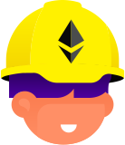

###

<h1 align="center">𝐻𝑒𝓁𝓁𝑜, 𝐼 '𝓂 𝒶 𝐹𝓊𝓁𝓁𝒮𝓉𝒶𝒸𝓀 𝒶𝓃𝒹 𝐵𝓁𝑜𝒸𝓀𝒸𝒽𝒶𝒾𝓃 𝐸𝓃𝑔𝒾𝓃𝑒𝑒𝓇</h1>

  

<h2 font-weight="bold">❄ᗩ𝒷𝑜𝓊𝓉 ൱𝑒</h2>

###

  
𝐈’𝐦 𝐚 𝐛𝐥𝐨𝐜𝐤𝐜𝐡𝐚𝐢𝐧 𝐝𝐞𝐯𝐞𝐥𝐨𝐩𝐞𝐫 𝐬𝐩𝐞𝐜𝐢𝐚𝐥𝐢𝐳𝐢𝐧𝐠 𝐢𝐧 𝐒𝐮𝐢 𝐚𝐧𝐝 𝐒𝐨𝐥𝐚𝐧𝐚, 𝐰𝐢𝐭𝐡 𝐞𝐱𝐭𝐞𝐧𝐬𝐢𝐯𝐞 𝐞𝐱𝐩𝐞𝐫𝐢𝐞𝐧𝐜𝐞 𝐛𝐮𝐢𝐥𝐝𝐢𝐧𝐠 𝐍𝐅𝐓 𝐠𝐚𝐦𝐞𝐬, 𝐦𝐚𝐫𝐤𝐞𝐭𝐩𝐥𝐚𝐜𝐞𝐬, 𝐃𝐞𝐟𝐢 𝐚𝐧𝐝 𝐞𝐯𝐞𝐧 𝐢𝐧𝐭𝐞𝐠𝐫𝐚𝐭𝐢𝐧𝐠 𝐦𝐞𝐭𝐚𝐯𝐞𝐫𝐬𝐞 𝐟𝐞𝐚𝐭𝐮𝐫𝐞𝐬. 
𝐈 𝐭𝐫𝐮𝐥𝐲 𝐛𝐞𝐥𝐢𝐞𝐯𝐞 𝐭𝐡𝐚𝐭 𝐚 𝐬𝐤𝐢𝐥𝐥𝐞𝐝 𝐝𝐞𝐯𝐞𝐥𝐨𝐩𝐞𝐫 𝐥𝐢𝐤𝐞 𝐦𝐲𝐬𝐞𝐥𝐟 𝐜𝐚𝐧 𝐛𝐫𝐢𝐧𝐠 𝐫𝐞𝐚𝐥 𝐯𝐚𝐥𝐮𝐞 𝐭𝐨 𝐲𝐨𝐮𝐫 𝐩𝐫𝐨𝐣𝐞𝐜𝐭. 
𝐈𝐟 𝐭𝐡𝐞𝐫𝐞 𝐚𝐫𝐞 𝐚𝐧𝐲 𝐨𝐩𝐞𝐧𝐢𝐧𝐠 𝐝𝐞𝐯 𝐩𝐨𝐬𝐢𝐭𝐢𝐨𝐧 𝐢𝐧 𝐭𝐡𝐢𝐬 𝐩𝐫𝐨𝐣𝐞𝐜𝐭, 𝐈’𝐝 𝐥𝐨𝐯𝐞 𝐭𝐨 𝐜𝐨𝐥𝐥𝐚𝐛𝐨𝐫𝐚𝐭𝐞 𝐚𝐧𝐝 𝐜𝐫𝐞𝐚𝐭𝐞 𝐬𝐨𝐦𝐞𝐭𝐡𝐢𝐧𝐠 𝐚𝐦𝐚𝐳𝐢𝐧𝐠 𝐭𝐨𝐠𝐞𝐭𝐡𝐞𝐫. 
𝐋𝐨𝐨𝐤𝐢𝐧𝐠 𝐟𝐨𝐫𝐰𝐚𝐫𝐝 𝐭𝐨 𝐡𝐞𝐚𝐫𝐢𝐧𝐠 𝐟𝐫𝐨𝐦 𝐲𝐨𝐮!

<h2 font-weight="bold">🌠Ꚃ𝓀𝒾𝓁𝓁𝓈</h2>

  

###

<table align="center">
<tr>
    <td align="center" width="90">
      
       NFT
    </td>
    <td align="center" width="90">
      
       DeFi
    </td>
    <td align="center" width="90">
      
       Ethereum
    </td>
    <td align="center" width="90">
      
       Solana
    </td>
    <td align="center" width="90">
      
       Solidity
    </td>
    <td align="center" width="90">
      
       Rust
    </td>
    <td align="center" width="90">
      
       Anchor
    </td>
    <td align="center" width="90">
      
       Foundry
    </td>
    <td align="center" width="90">
      
       HardHat
    </td>
    <td align="center" width="90">
      
       Rails
    </td>
  </tr>
  <tr>
    <td align="center" width="90">
      
       React
    </td>
    <td align="center" width="90">
      
       Next.js
    </td>
    <td align="center" width="90">
      
       React Native
    </td>
    <td align="center" width="90">
      
       Nuxt.js
    </td>
    <td align="center" width="90">
      
       Angular
    </td>
    <td align="center" width="90">
      
       Svelte
    </td>
    <td align="center" width="90">
      
       Tailwind
    </td>
    <td align="center" width="90">
        
       GraphQL
    </td>
    <td align="center" width="90">
      
       Three.js
    </td>
    <td align="center" width="90">
      
       Android
    </td>
  </tr>
  <tr>
    <td align="center" width="90">
      
       Ruby
    </td>
    <td align="center" width="90">
      
       GoLang
    </td>
    <td align="center" width="90">
      
       Express
    </td>
    <td align="center" width="90">
      
       Nest.js
    </td>
    <td align="center" width="90">
      
       Django
    </td>
    <td align="center" width="90">
      
       Laravel
    </td>
    <td align="center" width="90">
      
       Flutter
    </td>
    <td align="center" width="90">
      
       MongoDB
    </td>
    <td align="center" width="90">
      
       PostgreSQL
    </td>
    <td align="center" width="90">
      
       Python
    </td>
  </tr>
</table>
 

<h2 font-weight="bold">✨ᑕ𝑜𝓃𝓉𝒶𝒸𝓉</h2>

###

  
  
  
  

