###

  <!-- 3D animated banner -->
  

<h2 font-weight="bold">❄ᗩ𝒷𝑜𝓊𝓉 ൱𝑒</h2>

###

  
Full-stack & blockchain engineer shipping DataDAO, DeFi, and wallet UX across Sui, Solana, and EVM, rigorous data contracts, measurable UX, and production-minded code.

<h2 font-weight="bold">🌠Ꚃ𝓀𝒾𝓁𝓁𝓈</h2>

###

<table align="center">
<tr>
    <td align="center" width="90">
      
       NFT
    </td>
    <td align="center" width="90">
      
       DeFi
    </td>
    <td align="center" width="90">
      
       Ethereum
    </td>
    <td align="center" width="90">
      
       Solana
    </td>
    <td align="center" width="90">
      
       Solidity
    </td>
    <td align="center" width="90">
      
       Rust
    </td>
    <td align="center" width="90">
      
       Anchor
    </td>
    <td align="center" width="90">
      
       Foundry
    </td>
    <td align="center" width="90">
      
       HardHat
    </td>
    <td align="center" width="90">
      
       Rails
    </td>
  </tr>
  <tr>
    <td align="center" width="90">
      
       React
    </td>
    <td align="center" width="90">
      
       Next.js
    </td>
    <td align="center" width="90">
      
       React Native
    </td>
    <td align="center" width="90">
      
       Nuxt.js
    </td>
    <td align="center" width="90">
      
       Angular
    </td>
    <td align="center" width="90">
      
       Svelte
    </td>
    <td align="center" width="90">
      
       Tailwind
    </td>
    <td align="center" width="90">
        
       GraphQL
    </td>
    <td align="center" width="90">
      
       Three.js
    </td>
    <td align="center" width="90">
      
       Android
    </td>
  </tr>
  <tr>
    <td align="center" width="90">
      
       Ruby
    </td>
    <td align="center" width="90">
      
       GoLang
    </td>
    <td align="center" width="90">
      
       Express
    </td>
    <td align="center" width="90">
      
       Nest.js
    </td>
    <td align="center" width="90">
      
       Django
    </td>
    <td align="center" width="90">
      
       Laravel
    </td>
    <td align="center" width="90">
      
       Flutter
    </td>
    <td align="center" width="90">
      
       MongoDB
    </td>
    <td align="center" width="90">
      
       PostgreSQL
    </td>
    <td align="center" width="90">
      
       Python
    </td>
  </tr>
</table>
<h2 font-weight="bold">✨ᑕ𝑜𝓃𝓉𝒶𝒸𝓉</h2>

  
  
  
  

